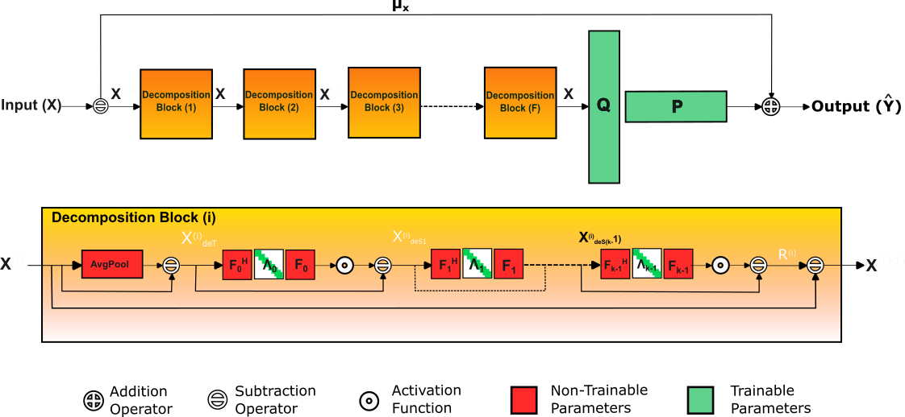
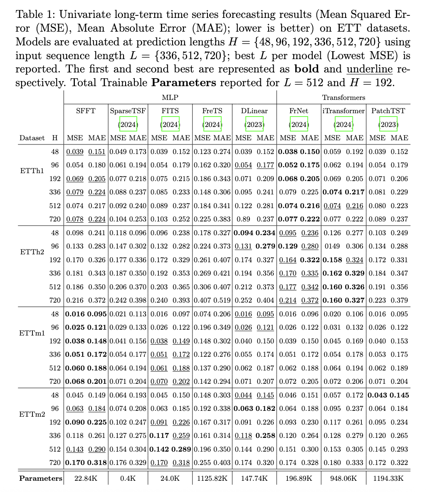
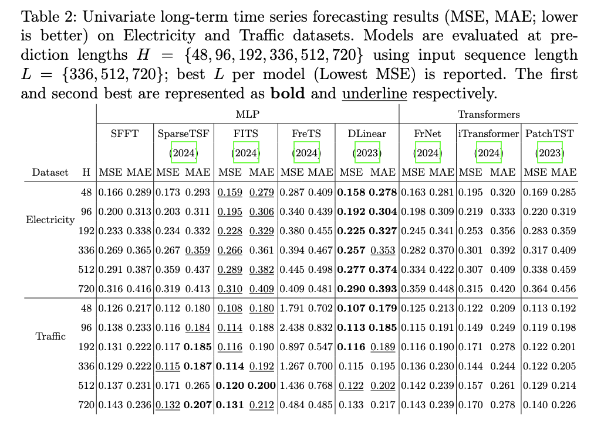

# SFFT: Symmetric Fourier Fragment Transform

**Symmetric Fourier Fragment Transform (SFFT)** is a lightweight time-domain model for long-term time series forecasting that embeds spectral structure into the decomposition process. Traditional time-domain models often struggle to disentangle residual noise from seasonal components, while frequency-domain methods require complex-valued operations. SFFT bridges this gap by combining simple trend extraction with learnable symmetric Fourier-based seasonal operators, all within the real domain. This enables effective multi-scale denoising and forecasting with minimal parameter overhead. In univariate benchmarks, SFFT achieves accuracy on par with leading frequency-based models while maintaining the efficiency and simplicity of time-domain methods.



# Overview

It decomposes time series into:
- **Seasonal components** modeled via learned *symmetric circulant matrices* in the Fourier domain (efficient, interpretable harmonic components).
- **Trend components** extracted via moving average.
- **Residual noise** removed by an iterative multi-block architecture.

The model can then perform *direct forecasting* of future values from the denoised representation via either:
- a standard Linear layer, or
- a Low-Rank Linear layer.

SFFT is **simple**, **fast**, and achieves competitive performance on a variety of time series benchmarks.

---

## Key Features

✅ **Fourier-based symmetric seasonal decomposition**  
✅ **Trend extraction via moving average**  
✅ **Stackable Decompose blocks** for progressive denoising  
✅ **Optional Low-Rank prediction head**  
✅ **Channel-wise or shared model architecture**  
✅ Lightweight, interpretable, no recurrence or self-attention  

---

# Usage

## Initialization
```
model = Model(configs)
```

## Configuration Options
| Parameter       | Description                                    | Default |
|---------------|--------------------------------|---------|
| `seq_len`     | Input sequence length                         | -       |
| `pred_len`    | Output prediction length                      | -       |
| `enc_in`    | Number of input features                      | -       |
| `individual`  | If True, applies a separate layer per feature | False   |
| `bias`        | Enables bias in the low-rank layer            | True    |
| `decomposer_depth` | Number of stacked Decompose blocks       | 1    |
| `kernel_size`  | Moving average kernel size for Trend extraction             | 50    |
| `seasons`  | Number of Seasonal modules per Decompose block    | 1    |
| `enable_lowrank`  | Enables Low Rank or Standard Linear Layer    | True    |
| `rank`        | Rank of the low-rank layer                    | 30      |

## Forward Pass
```
output = model(X)
```

# Results





# Acknowledgement
The listed github repositories have been used for code bases, datasets and comparisons.

- https://github.com/zhouhaoyi/Informer2020
- https://github.com/lss-1138/SparseTSF
- https://github.com/cure-lab/LTSF-Linear
- https://github.com/aikunyi/FreTS
- https://github.com/luodhhh/ModernTCN
- https://github.com/yuqinie98/patchtst
- https://github.com/thuml/iTransformer
- https://github.com/SiriZhang45/FRNet


## License
This project is licensed under the MIT License.
